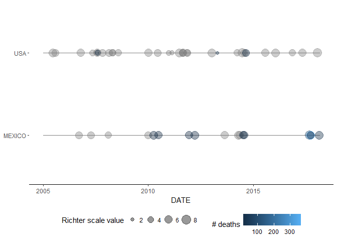
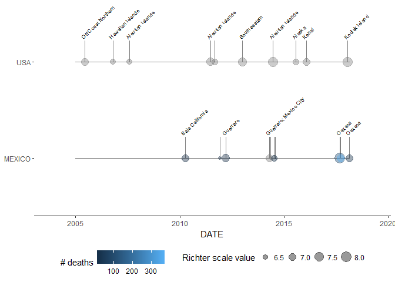

README
================
Cody Schulz
February 26, 2018

earthquakeMap
=============

earthquakeMap helps users visualize over 4,000 years of earthquake statistics in both time and space.

Installation
------------

earthquakeMap can be installed using `devtools`:

``` r
library(devtools)
install_github("codyschulz/earthquakeMap")
library(earthquakeMap)
```

Setup
-----

``` r
## Open packages
libs <- c("readr", "magrittr", "dplyr", "earthquakeMap", "ggplot2", "lubridate")
lapply(libs, require, character.only = TRUE)

## Open dataset
x <- earthquake_read() %>%
  
  ## Clean
  eq_clean_data() %>%
  
  ## Filter
  filter(COUNTRY %in% c("USA", "MEXICO") & year(date) >= 2000) 

## Create a theme
my_theme <-   theme(
  axis.title.y = element_blank(),
  panel.background = element_blank(),
  legend.position="bottom",
  legend.key = element_blank(),
  axis.line.x = element_line()
)
```

Earthquake Plotting in Time
---------------------------

earthquakeMap's `geom_timeline()` function displays earthquakes on a timeline, with point size corresponding to magnitude and point color to the number of fatalities. Each country selected is given its own timeline. Below is a plot of all earthquakes in the US and Mexico since 2005.

``` r
plot0 <- ggplot() +
  geom_timeline(data = x, aes(
    x = date,
    xmin = as.Date("2005-01-01"), 
    xmax = as.Date("2018-02-22"), 
    colour = TOTAL_DEATHS, 
    y = COUNTRY, 
    size = EQ_PRIMARY
    )
  ) +
  scale_size_continuous(name = "Richter scale value") +
  scale_colour_continuous(name = "# deaths") +
  xlab("DATE") +
  my_theme
plot0
```



The `geom_timeline_label` function provides additional labeling and subsetting capabilities. Users can set a maximum number of earthquakes to plot per country using the `n_max` parameter (the function selects the highest magnitude earthquakes first). The output also provides location labels for many earthquakes. Below is a graph of the same set of earthquakes as the prior example, selecting only the 10 highest magnitude earthquakes.

``` r
plot1 <- ggplot() +
  geom_timeline_label(data = x, aes(
    x = date, 
    xmin = as.Date("2005-01-01"), 
    label = LOCATION_NAME,
    xmax = as.Date("2018-02-22"), 
    colour = TOTAL_DEATHS, 
    y = COUNTRY, 
    size = EQ_PRIMARY
    ),
    n_max = 10
  ) +
  scale_x_date(expand = c(.15, .15)) +
  scale_size_continuous(name = "Richter scale value") +
  scale_colour_continuous(name = "# deaths") +
  xlab("DATE") +
  my_theme
plot1
```



Earthquake Plotting in Space
----------------------------

earthquakeMap's `eq_map` function shows earthquakes on an interactive map, with more information the earthquake provided when users click on the plotted point. Below is an example map using the same set of earthquakes as the first plot.

``` r
x %>%
  ## Create a popup text label with the eq_create_label function
  mutate(popup_text = eq_create_label(.)) %>%
  eq_map(annot_col = "popup_text")
```

<!--html_preserve-->

<script type="application/json" data-for="htmlwidget-7987b30b6dcb99d1f44e">{"x":{"options":{"crs":{"crsClass":"L.CRS.EPSG3857","code":null,"proj4def":null,"projectedBounds":null,"options":{}}},"calls":[{"method":"addProviderTiles","args":["CartoDB.Positron",null,null,{"errorTileUrl":"","noWrap":false,"zIndex":null,"unloadInvisibleTiles":null,"updateWhenIdle":null,"detectRetina":false,"reuseTiles":false}]},{"method":"addCircleMarkers","args":[[38.379,47.149,34.059,18.194,32.319,44.513,16.87,63.514,63.517,18.77,34.31,34.494,36.87,51.146,35.706,17.488,35.819,41.301,45.365,26.319,19.878,17.302,45.394,37.804,51.307,39.465,39.464,37.434,32.456,41.153,38.452,39.52,33.953,32.437,40.652,32.297,32.7,16.396,35.827,38.947,52.05,37.063,37.936,52.171,35.532,35.531,17.844,16.493,55.393,31.817,16.878,33.932,17.552,17.385,51.797,14.742,58.358,17.842,38.22,52.376,59.658,35.984,59.844,15.022,18.584,16.737,56.046,16.646],[-122.413,-122.727,-118.387,-95.908,-115.322,-73.699,-100.113,-147.912,-147.444,-104.104,-116.848,-85.629,-88.98,178.65,-121.102,-101.303,-120.364,-125.97,-112.615,-86.606,-155.935,-100.198,-112.13,-122.193,-179.971,-111.237,-111.207,-121.774,-115.315,-114.867,-87.886,-119.93,-117.761,-115.165,-124.692,-115.278,-115.921,-97.782,-96.772,-107.497,-171.836,-104.701,-77.933,-171.708,-96.765,-96.788,-99.963,-98.231,-134.652,-97.088,-99.498,-117.917,-100.816,-100.656,178.76,-92.409,-137.13,-95.524,-122.313,-169.446,-153.452,-96.798,-136.695,-93.899,-98.399,-94.946,-149.073,-97.653],[5,6.8,4.2,5.9,5.5,5.2,5.3,6.7,7.9,7.5,5.2,4.6,4,7.8,6.6,6.1,6,7.2,5.6,5.8,6.7,6,4.5,4.2,6.7,4.2,1.6,5.6,5.1,6,5.3,5,5.4,5.9,6.5,7.2,5.8,6.2,3.7,3.1,7.3,5.4,5.8,6.8,5.7,5,6.4,7.4,7.5,2.1,6.2,5.1,7.2,6.4,7.9,6.9,6.1,6.3,6,6.9,7.1,5,6.2,8.2,7.1,6.1,7.9,7.2],null,null,{"lineCap":null,"lineJoin":null,"clickable":true,"pointerEvents":null,"className":"","stroke":true,"color":"#03F","weight":2,"opacity":0.4,"fill":true,"fillColor":"#03F","fillOpacity":0.2,"dashArray":null},null,null,[" <b>Location: <\/b> Napa <br /> <b>Magnitude: <\/b> 5 <br />"," <b>Location: <\/b> Olympia <br /> <b>Magnitude: <\/b> 6.8 <br /> <b>Total deaths: <\/b> 1 <br />"," <b>Location: <\/b> Los Angeles <br /> <b>Magnitude: <\/b> 4.2 <br />"," <b>Location: <\/b> Veracruz <br /> <b>Magnitude: <\/b> 5.9 <br />"," <b>Location: <\/b> Mexicali <br /> <b>Magnitude: <\/b> 5.5 <br />"," <b>Location: <\/b> Clinton <br /> <b>Magnitude: <\/b> 5.2 <br />"," <b>Location: <\/b> Acapulco <br /> <b>Magnitude: <\/b> 5.3 <br />"," <b>Location: <\/b> Cantwell <br /> <b>Magnitude: <\/b> 6.7 <br />"," <b>Location: <\/b> Slana <br /> <b>Magnitude: <\/b> 7.9 <br />"," <b>Location: <\/b> Villa De Alvarez <br /> <b>Magnitude: <\/b> 7.5 <br /> <b>Total deaths: <\/b> 29 <br />"," <b>Location: <\/b> Big Bear City <br /> <b>Magnitude: <\/b> 5.2 <br />"," <b>Location: <\/b> Fort Payne <br /> <b>Magnitude: <\/b> 4.6 <br />"," <b>Location: <\/b> Bardwell <br /> <b>Magnitude: <\/b> 4 <br />"," <b>Location: <\/b> Aleutian Islands <br /> <b>Magnitude: <\/b> 7.8 <br />"," <b>Location: <\/b> Paso Robles <br /> <b>Magnitude: <\/b> 6.6 <br /> <b>Total deaths: <\/b> 2 <br />"," <b>Location: <\/b> Guerrero <br /> <b>Magnitude: <\/b> 6.1 <br />"," <b>Location: <\/b> Central <br /> <b>Magnitude: <\/b> 6 <br />"," <b>Location: <\/b> Off Coast Northern <br /> <b>Magnitude: <\/b> 7.2 <br />"," <b>Location: <\/b> Dillon <br /> <b>Magnitude: <\/b> 5.6 <br />"," <b>Location: <\/b> Gulf Of Mexico <br /> <b>Magnitude: <\/b> 5.8 <br />"," <b>Location: <\/b> Hawaiian Islands <br /> <b>Magnitude: <\/b> 6.7 <br />"," <b>Location: <\/b> Guerrero <br /> <b>Magnitude: <\/b> 6 <br />"," <b>Location: <\/b> Sheridan <br /> <b>Magnitude: <\/b> 4.5 <br />"," <b>Location: <\/b> Montclair <br /> <b>Magnitude: <\/b> 4.2 <br />"," <b>Location: <\/b> Aleutian Islands <br /> <b>Magnitude: <\/b> 6.7 <br />"," <b>Location: <\/b> Huntington <br /> <b>Magnitude: <\/b> 4.2 <br /> <b>Total deaths: <\/b> 9 <br />"," <b>Location: <\/b> Utah <br /> <b>Magnitude: <\/b> 1.6 <br /> <b>Total deaths: <\/b> 3 <br />"," <b>Location: <\/b> San Jose <br /> <b>Magnitude: <\/b> 5.6 <br />"," <b>Location: <\/b> Baja California <br /> <b>Magnitude: <\/b> 5.1 <br />"," <b>Location: <\/b> Wells <br /> <b>Magnitude: <\/b> 6 <br />"," <b>Location: <\/b> West Salem <br /> <b>Magnitude: <\/b> 5.3 <br />"," <b>Location: <\/b> Fallon <br /> <b>Magnitude: <\/b> 5 <br />"," <b>Location: <\/b> Los Angeles <br /> <b>Magnitude: <\/b> 5.4 <br />"," <b>Location: <\/b> Mexicali <br /> <b>Magnitude: <\/b> 5.9 <br />"," <b>Location: <\/b> Off Coast Northern <br /> <b>Magnitude: <\/b> 6.5 <br />"," <b>Location: <\/b> Baja California <br /> <b>Magnitude: <\/b> 7.2 <br /> <b>Total deaths: <\/b> 2 <br />"," <b>Location: <\/b> Ocotillo <br /> <b>Magnitude: <\/b> 5.8 <br />"," <b>Location: <\/b> San Andres Huaxpaltepec <br /> <b>Magnitude: <\/b> 6.2 <br /> <b>Total deaths: <\/b> 1 <br />"," <b>Location: <\/b> Luther <br /> <b>Magnitude: <\/b> 3.7 <br />"," <b>Location: <\/b> Paonia <br /> <b>Magnitude: <\/b> 3.1 <br />"," <b>Location: <\/b> Aleutian Islands <br /> <b>Magnitude: <\/b> 7.3 <br />"," <b>Location: <\/b> Segundo <br /> <b>Magnitude: <\/b> 5.4 <br />"," <b>Location: <\/b> Louisa County <br /> <b>Magnitude: <\/b> 5.8 <br />"," <b>Location: <\/b> Aleutian Islands <br /> <b>Magnitude: <\/b> 6.8 <br />"," <b>Location: <\/b> Sparks <br /> <b>Magnitude: <\/b> 5.7 <br />"," <b>Location: <\/b> Sparks <br /> <b>Magnitude: <\/b> 5 <br />"," <b>Location: <\/b> Guerrero <br /> <b>Magnitude: <\/b> 6.4 <br /> <b>Total deaths: <\/b> 2 <br />"," <b>Location: <\/b> Guerrero <br /> <b>Magnitude: <\/b> 7.4 <br /> <b>Total deaths: <\/b> 2 <br />"," <b>Location: <\/b> Southeastern <br /> <b>Magnitude: <\/b> 7.5 <br />"," <b>Location: <\/b> West <br /> <b>Magnitude: <\/b> 2.1 <br /> <b>Total deaths: <\/b> 14 <br />"," <b>Location: <\/b> San Marcos <br /> <b>Magnitude: <\/b> 6.2 <br />"," <b>Location: <\/b> La Habra <br /> <b>Magnitude: <\/b> 5.1 <br />"," <b>Location: <\/b> Guerrero; Mexico City <br /> <b>Magnitude: <\/b> 7.2 <br />"," <b>Location: <\/b> Tecpan <br /> <b>Magnitude: <\/b> 6.4 <br />"," <b>Location: <\/b> Aleutian Islands <br /> <b>Magnitude: <\/b> 7.9 <br />"," <b>Location: <\/b> San Marcos <br /> <b>Magnitude: <\/b> 6.9 <br /> <b>Total deaths: <\/b> 3 <br />"," <b>Location: <\/b> Southeastern <br /> <b>Magnitude: <\/b> 6.1 <br />"," <b>Location: <\/b> Oaxaca <br /> <b>Magnitude: <\/b> 6.3 <br /> <b>Total deaths: <\/b> 1 <br />"," <b>Location: <\/b> Napa <br /> <b>Magnitude: <\/b> 6 <br /> <b>Total deaths: <\/b> 1 <br />"," <b>Location: <\/b> Alaska <br /> <b>Magnitude: <\/b> 6.9 <br />"," <b>Location: <\/b> Kenai <br /> <b>Magnitude: <\/b> 7.1 <br />"," <b>Location: <\/b> Cushing <br /> <b>Magnitude: <\/b> 5 <br />"," <b>Location: <\/b> Skagway <br /> <b>Magnitude: <\/b> 6.2 <br />"," <b>Location: <\/b> Oaxaca <br /> <b>Magnitude: <\/b> 8.2 <br /> <b>Total deaths: <\/b> 98 <br />"," <b>Location: <\/b> Mexico City <br /> <b>Magnitude: <\/b> 7.1 <br /> <b>Total deaths: <\/b> 369 <br />"," <b>Location: <\/b> Oaxaca <br /> <b>Magnitude: <\/b> 6.1 <br /> <b>Total deaths: <\/b> 5 <br />"," <b>Location: <\/b> Kodiak Island <br /> <b>Magnitude: <\/b> 7.9 <br />"," <b>Location: <\/b> Oaxaca <br /> <b>Magnitude: <\/b> 7.2 <br /> <b>Total deaths: <\/b> 13 <br />"],null,null,null,null]}],"limits":{"lat":[14.742,63.517],"lng":[-179.971,178.76]}},"evals":[],"jsHooks":[]}</script>
<!--/html_preserve-->
